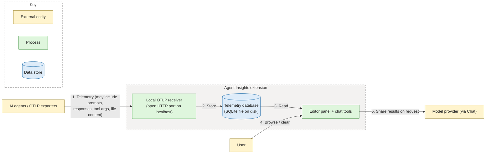

# Agent Insights Extension — Threat Model (High Level)

**Scope:** How the VS Code extension collects, stores, and shares telemetry.
**Method:** Data-flow diagram and STRIDE, per the
[Microsoft Threat Modeling Tool](https://learn.microsoft.com/en-us/azure/security/develop/threat-modeling-tool-getting-started)
and [STRIDE categories](https://learn.microsoft.com/en-us/azure/security/develop/threat-modeling-tool-threats).

## What the extension does

Agent Insights runs a local receiver — an open HTTP port on localhost — that accepts
OpenTelemetry data from AI agents, stores it in a SQLite database on disk, shows it in an
in-editor panel, and can surface it in Copilot Chat.

## Data-flow diagram

Trust boundaries (dashed boxes) are crossed at flow 1 (sources → extension),
flow 2 (extension → local disk), and flow 5 (extension → model provider via Chat).

## What's at stake

Telemetry can contain sensitive content — prompts, responses, tool arguments, file
contents, and errors — depending on the user's capture settings. It is stored locally
in plaintext and can be shared into Copilot Chat on request.

## Key risks (STRIDE)

| STRIDE | Risk | Direction today |
|---|---|---|
| **Spoofing / Tampering** | The receiver accepts telemetry with no authentication, so any local process (or a browser page, since CORS is open) can inject or forge data. | Listener is loopback-only; consider whether local processes are in scope and restrict CORS. |
| **Information Disclosure (at rest)** | Captured content is stored unencrypted under the user profile; anyone with the same OS account (or backup tooling) can read it. | Capture is opt-in with row/byte limits and a clear command; confirm classification and retention needs. |
| **Information Disclosure (egress)** | Chat tools can send stored telemetry to an external model provider, with that provider's logging and retention. | User-initiated; add clear disclosure and consider redaction for content-bearing results. |
| **Denial of Service** | The receiver has no request-size limit, so a large or malformed payload could stall the extension host. | Add body-size and rate limits before parsing. |
| **Elevation of Privilege** | Untrusted telemetry is rendered in the webview; a rendering gap could run script in the panel. | Strict CSP and output escaping in place; keep rendering on safe paths. |

## Questions for the consultation

1. Are other local processes (same or different OS user) considered attackers?
2. Is captured content (prompts, responses, file contents) acceptable to store in plaintext locally?
3. Which model providers may receive telemetry-derived content, and under what policy?
4. Is encryption at rest or OS-level file protection expected?
5. Is this a developer tool, or will its data be treated as trusted audit evidence?

## Out of scope

VS Code itself, the agents/exporters, the model provider, the operating system, and the
extension build/update pipeline.
